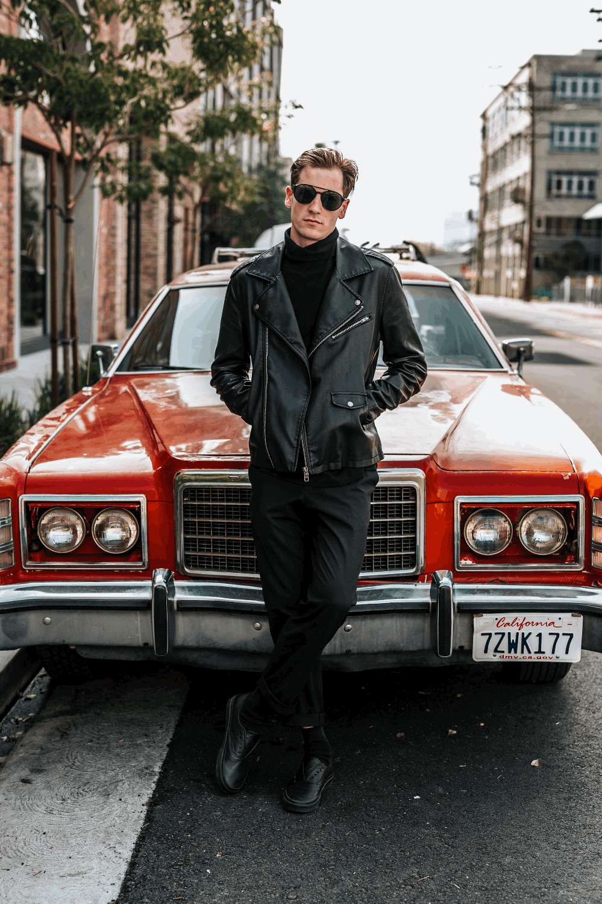

<h1 align=center>
  Auto-Inpainting
  <br>
</h1>
<h4 align=center>Recognize and remove needless foreground from your photos in a smart way.</h4>

## Install

1. Clone this repo and dependent submodules to your local filesystem
    ```bash
    (base) $ git clone --recurse-submodules https://github.com/jaredyam/auto-inpainting.git
    ```
2. `cd` to the repo and create an independent virual environment with conda
    ```bash
    (base) $ cd <path/to/auto-inpainting>
    (base) $ conda create --name auto-inpainting python=3.8
    (base) $ conda activate auto-inpainting
    (auto-inpainting) $ pip install -r requirements.txt
    ```

## Inference

Before making inference, we should first prepare pre-trained models (from the original repo):
- segmentaion model:
    - U2Net: download the pre-trained model u2net.pth (176.3 MB) from [**GoogleDrive**](https://drive.google.com/file/d/1ao1ovG1Qtx4b7EoskHXmi2E9rp5CHLcZ/view?usp=sharing) or [**Baidu Wangpan (code: pf9k)**](https://pan.baidu.com/s/1WjwyEwDiaUjBbx_QxcXBwQ) and put it into the dirctory `./segmentation-models/U-2-Net/saved_models/u2net/`.
- inpainting model:
    - LAMA: download the folder [big-lama](https://disk.yandex.ru/d/ouP6l8VJ0HpMZg) and put it in to the directory `./inpainting-models/lama/`.

Then, make inference on a single image by running
```bash
(auto-inpainting) $ bash inference.sh <path/to/input-image>
```

## Gallery
|                     Original                      |                        Demo                        |
|:-------------------------------------------------:|:--------------------------------------------------:|
|  |  |
|  |  |
|  |  |
|  |  |
|  |  |
